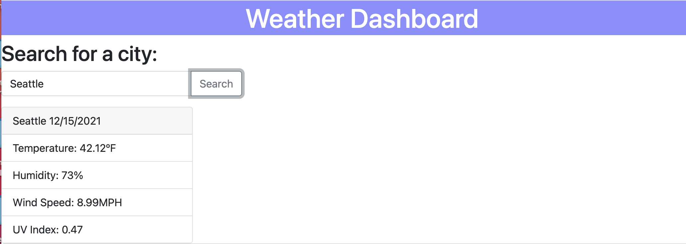

# weekly-weather
A weather dashboard including a 5-day forecast using data from a third-party weather API.

## What I Learned
In this project I learned to fetch data from a third-party API and implement that data into a useful application. I stumbled on printing/rendering this data to my webpage, but found it easier to structure the elements in Javascript after first building out what was needed first in the HTML file.

## Links
https://github.com/ChristinaBohn/weekly-weather

https://christinabohn.github.io/weekly-weather/

## Site Preview

